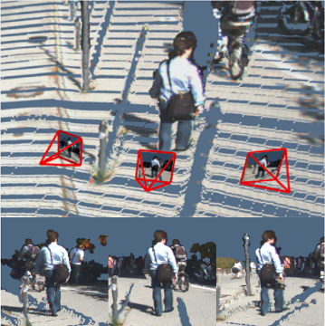
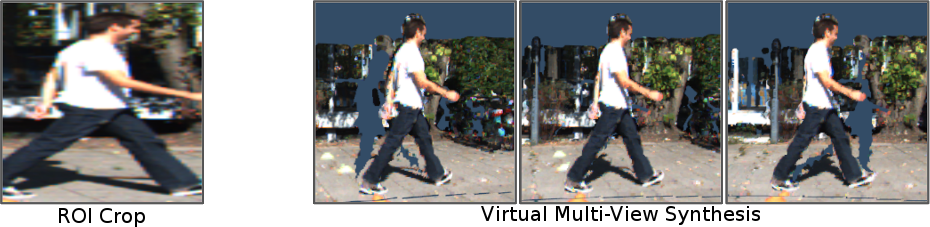

# Virtual Multi-View Synthesis
Improving pedestrian heading estimation with Virtual Multi-View Synthesis (VMVS)



If you find this code useful, please consider citing:
```bibtex
@article{ku2019vmvs,
  title={Improving 3d Object Detection for Pedestrians with Virtual Multi-View Synthesis Orientation Estimation},
  author={Ku, Jason and Pon, Alex D and Walsh, Sean and Waslander, Steven L},
  journal={IROS},
  year={2019}
}
```

### Setup
- Download the KITTI [3D Object Detection Dataset](http://www.cvlibs.net/datasets/kitti/eval_object.php?obj_benchmark=3d)
- Go to [scene_vis](https://github.com/kujason/scene_vis) and generate dense depth maps
    - `scene_vis/scripts/depth_completion/save_depth_maps_obj.py`
- Clone this repo
```
git clone git@github.com:kujason/vmvs.git
pip install -r requirements
```
### Demos
- `save_crops_roi.py` - Saves ROI crops of all pedestrians in the dataset (for comparison)
- `save_crops_vmvs.py` - Saves images from virtual views of all pedestrians in the dataset
- `bash save_crops_vmvs_multiproc.sh` - Runs multiple processes to save images
- `show_crops_grid.py` - Shows virtual views of pedestrians in a grid using multiple renderers (faster than `save_crops_vmvs.py`) 


